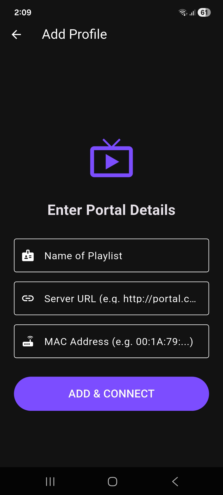

📺 MAC Portal Player

A cross-platform IPTV media player built with Flutter, featuring MAC/Stalker portal authentication, custom UI overlays, Picture-in-Picture, and external player support.

## ✨ Features

- **🔐 MAC Portal / Stalker Portal authentication** — connect using your device MAC address and portal URL
- **📡 Live IPTV streaming** — powered by `media_kit` for smooth, low-latency playback
- **🎨 Custom UI overlays** — fully custom player controls with channel info, progress, and gesture support
- **📱 Picture-in-Picture (PiP)** — continue watching while using other apps on Android (using `simple_pip_mode`)
- **🔗 External player support** — launch streams in VLC, MX Player, or any Android Intent-compatible player
- **🗂️ Channel browsing** — navigate categories and channels natively from the portal
- **🌐 Cross-platform** — targets Android, iOS, and Desktop from a single codebase
- **⚡ Provider state management** — clean, reactive architecture using the Provider package

## 📸 Screenshots

<p align="center">
  
</p>

## 🛠️ Tech Stack

| Layer | Technology / Framework |
| :--- | :--- |
| **Framework** | Flutter |
| **Language** | Dart |
| **State Management** | Provider |
| **Media Playback** | `media_kit` |
| **HTTP Client** | `http` |
| **External Integrations** | Custom `mx_player_plugin` (Native Method Channels) |

## 📋 Prerequisites

- Flutter SDK 3.x or later
- Dart 3.x
- Android SDK (for Android builds) or Xcode (for iOS builds)
- A valid MAC Portal / Stalker Portal URL and registered MAC address

## 🚀 Getting Started

1. **Clone the repository**
   ```bash
   git clone https://github.com/zakarighalib/mac-portal-player.git
   cd mac-portal-player
   ```
2. **Install dependencies**
   ```bash
   flutter pub get
   ```
3. **Run the app**
   ```bash
   # Android
   flutter run

   # iOS
   flutter run -d ios

   # Desktop (Linux/macOS/Windows)
   flutter run -d windows
   ```

## ⚙️ Configuration

On first launch, enter your portal details in the settings screen:

| Field | Description |
| :--- | :--- |
| **Portal URL** | The base URL of your Stalker/MAC portal (e.g., `http://your-portal.com/c/`) |
| **MAC Address** | The MAC address registered on the portal (e.g., `00:1A:79:XX:XX:XX`) |

These credentials are stored locally using `shared_preferences` and are used to authenticate all API requests to the portal.

## 📁 Project Structure

```
lib/
├── main.dart                 # App entry point
├── api/                      # Portal API and HTTP client logic
├── models/                   # Data models (Channel, Category, ContentItem...)
├── providers/                # Provider state classes
├── screens/                  # UI screens (Login, Player, Content List, Settings...)
└── utils/                    # Helper functions (Playback helper, logic utilities)
android/
└── app/src/main/             # Android-specific configs (PiP, Intents, permissions)
assets/                       # Icons, fonts, placeholder images
```

## 🎮 External Players

MAC Portal Player supports launching any stream in an external player using a custom intent plugin. Supported players include:

- VLC for Android (`org.videolan.vlc`)
- MX Player (`com.mxtech.videoplayer.ad` / `.pro`)

To use this feature, tap the options menu on any channel and select **Open in external player**.

## 🔧 Android Permissions

The application requires internet access, declared in `AndroidManifest.xml`:
```xml
<uses-permission android:name="android.permission.INTERNET" />
<uses-permission android:name="android.permission.ACCESS_NETWORK_STATE" />
```

PiP mode is supported and enabled by setting `android:supportsPictureInPicture="true"` within the Android `<activity>` tag. It is automatically triggered when navigating away while the player is active.

---

> **⚠️ Disclaimer:** This application is intended for use with legally authorized IPTV subscriptions only. The author does not endorse or support the use of this software for unauthorized access to copyrighted content.
